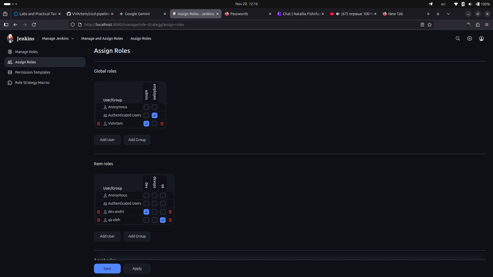
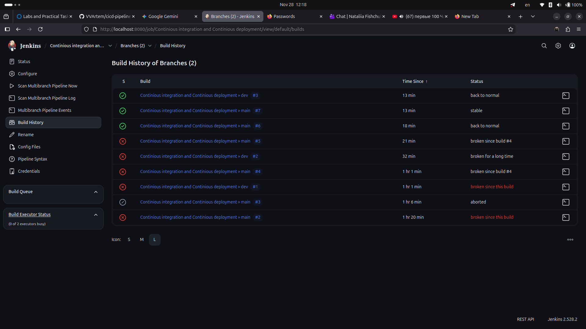
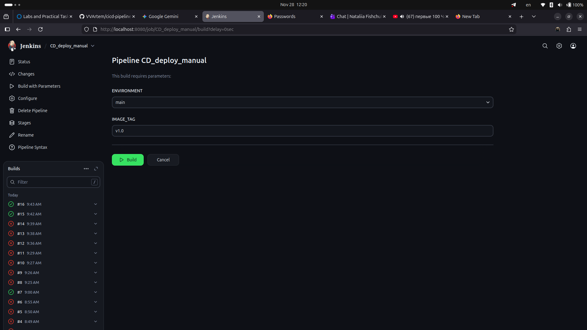

# CI/CD Пайплайн для Node.js додатку з використанням Jenkins та Docker

Цей проєкт демонструє повний цикл CI/CD (Continuous Integration & Deployment) для React/Node.js додатку. Проєкт використовує Jenkins для автоматизації, Docker для контейнеризації, а також реалізує чітке розділення середовищ (`main` та `dev`) із налаштуванням рольової моделі доступу (RBAC).

## Огляд проєкту

Система розроблена для виконання наступних завдань:
1.  **Автоматизований CI/CD:** Автоматична збірка, тестування та деплой змін при кожному пуші в GitHub.
2.  **Ручний деплой (Manual Deployment):** Можливість розгортання конкретних версій із вибором параметрів через інтерфейс Jenkins.
3.  **Безпека:** Доступ користувачів обмежено на основі ролей (Dev, QA, DevOps).

---

## Рольова модель доступу (RBAC)

Безпеку налаштовано за допомогою плагіна **Role-based Authorization Strategy**. Створено три групи користувачів із різними рівнями доступу:

* **DevOps (Admin):** Повний доступ до керування Jenkins, налаштування джобів (Jobs) та системних змін.
* **Developers (Dev):** Мають право переглядати та запускати збірки (Run jobs), але не можуть змінювати глобальні налаштування.
* **QA Team:** Тільки читання (Read-only). Можуть переглядати логи та статуси пайплайнів, але не мають права запускати їх.

**Створені користувачі:**
* `devops_user`
* `dev_user`
* `qa_user`

---

## Налаштування пайплайнів

Реалізовано два різні підходи до розгортання для демонстрації гнучкості Jenkins.

### A. Multibranch Pipeline (Автоматизований CI/CD)
* **Тип:** Multibranch Pipeline.
* **Джерело коду:** Використовує файл `Jenkinsfile`, що лежить безпосередньо в репозиторії GitHub.
* **Тригер:** Запускається автоматично при кожному `git push`.
* **Логіка:** Пайплайн динамічно визначає назву гілки та адаптує стратегію деплою:
    * **Гілка Main:** Розгортає стабільний код на **Порт 3000** (Образ: `nodemain`).
    * **Гілка Dev:** Розгортає тестовий код на **Порт 3001** (Образ: `nodedev`).
* **Ключові особливості:**
    * Автоматичний запуск тестів (`npm test` із прапорцем `CI=true`).
    * Деплой з мінімальним простоєм (видалення старого контейнера -> запуск нового).
    * Ізоляція Docker-образів для різних середовищ.

### B. Ручний пайплайн розгортання (`CD_deploy_manual`)
* **Тип:** Pipeline (Звичайний).
* **Джерело коду:** Скрипт пайплайну прописаний **безпосередньо в інтерфейсі Jenkins** (а не в репозиторії).
* **Тригер:** Запускається тільки вручну авторизованими користувачами.
* **Параметризована збірка:**
    * **`ENVIRONMENT` (Choice):** Вибір цільового середовища (`main` або `dev`).
    * **`IMAGE_TAG` (String):** Введення тегу Docker-образу вручну (наприклад, `v1.0`, `v2.0`).

Цей пайплайн корисний для відкату версій (rollback) або розгортання специфічних тегів без внесення змін у код репозиторію.

---

## Як запустити

### Автоматичний спосіб:
1.  Зробіть зміни в коді та виконайте `push` у гілку `dev` або `main`.
2.  Jenkins автоматично побачить зміни, збере Docker-образ та розгорне контейнер.
3.  Додаток доступний за адресою `http://localhost:3000` (Main) або `http://localhost:3001` (Dev).

### Ручний спосіб:
1.  Перейдіть у джоб `CD_deploy_manual` в Jenkins.
2.  Натисніть **Build with Parameters** (Зібрати з параметрами).
3.  Оберіть середовище (Environment) та впишіть тег образу.
4.  Натисніть **Build**.